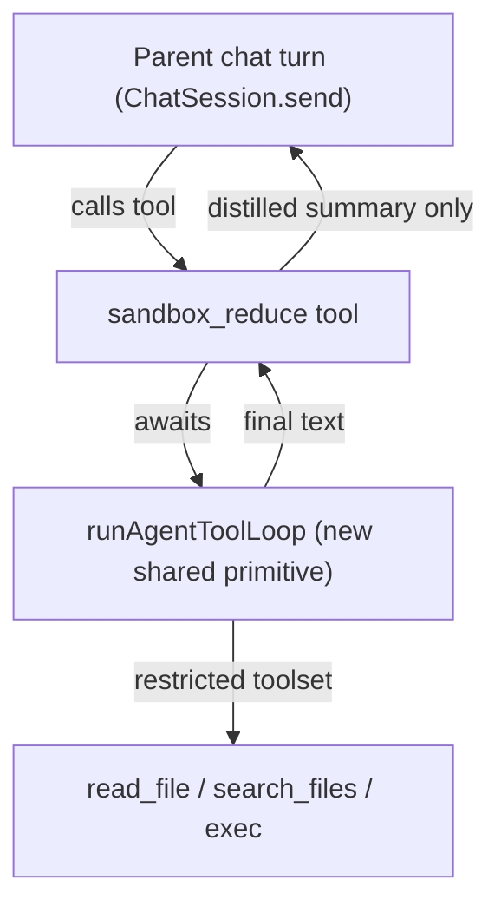

# Reduction Subagent (Design)

> Status: **implemented.** The shared loop primitive ships as
> `AgentToolLoop` (`Packages/MuwaCore/Services/Chat/AgentToolLoop.swift`),
> adopted by all three loop surfaces, and `sandbox_reduce`
> (`Packages/MuwaCore/Tools/SandboxReduceTool.swift`) is registered with
> the other exec-gated sandbox tools. This document remains as the design
> rationale; details below describe the original proposal. The driver's
> current behavior — policy knobs, two-phase parallel batches, KV-stable
> compaction, and the eval proof lane — is documented in
> [AGENT_LOOP.md — The Canonical Loop Driver](AGENT_LOOP.md#the-canonical-loop-driver-agenttoolloop).

## Problem

Muwa targets small, local models with tight context budgets. A recurring
need is "read a lot, return a little": scan five log files and return the ten
relevant errors, walk a directory tree and summarize what changed, fetch N
pages and extract the one fact that matters. The raw bytes must **not** land in
the model's context — only the distilled result should.

`sandbox_execute_code` used to cover this by letting the model write a Python
script that called tools in-process and `print()`ed only the reduced output. It
has been removed (see [SANDBOX.md](SANDBOX.md) migration note) because it added
no capability over `sandbox_write_file` + `sandbox_exec` and its tool-as-Python
bridge was a large, security-sensitive surface. The straightforward
replacement — `sandbox_write_file` a script, then `sandbox_exec("python3
script.py")` — recovers most of the value: the script still reduces output
before it returns.

What that replacement does **not** give back is *model-driven* reduction: a
nested agent that can read, reason, branch, and decide what's relevant using the
LLM itself, then hand back a short natural-language summary. That is what a
"reduction subagent" provides, and it is the Cursor-style answer (a `Task`-style
subagent that returns a digest to the parent turn).

## Current gap

There is **no reusable in-turn nested tool-loop primitive** in the codebase
today.

- **"Agents" are personas, not subagents.** `AgentManager` manages persistent
  chat personas (prompt + model + tool policy + identity), not spawnable
  sub-conversations.
- **`dispatch` is the wrong shape.** `TaskDispatcher` /
  `BackgroundTaskManager.dispatchChat` start a *separate, asynchronous*
  `ChatSession` and return a `task_id` immediately; the caller must poll
  `GET /v1/tasks/{id}`. It is fire-and-forget background work with its own
  session, toast/notification side effects, and external-surface security rules
  — not "block this tool call, run a nested loop, return distilled text."
- **The agent loop is duplicated, not extracted.** The
  `stream → run tools → append messages → repeat` loop exists in three places
  with no shared entry point:
  - `ChatSession.send` ([ChatView.swift](../Packages/MuwaCore/Views/Chat/ChatView.swift), outer `while attempts < maxAttempts`)
  - `HTTPHandler` (OpenAI-style streaming completions, `while iteration < maxIterations`)
  - `PluginHostAPI.complete` / `complete_stream` (`for iteration in 1...maxIterations`)



## Proposed design

### 1. Extract a shared `runAgentToolLoop` primitive

Refactor the canonical loop out of `ChatSession.send` into a standalone,
awaitable async function (behavior-preserving). Rough shape:

```swift
func runAgentToolLoop(
    messages: [ChatMessage],          // seed conversation (system + task)
    toolAllowlist: Set<String>,       // restricted toolset
    maxIterations: Int,               // hard cap, separate from parent
    model: ModelHandle,               // usually the parent's model
    sessionId: String,                // ephemeral, child-scoped
    cancellation: CancellationToken
) async throws -> String              // final assistant text (or complete() summary)
```

`ChatSession.send` becomes a thin caller of this primitive so the UI path and
the subagent path share one implementation. The existing prompt/loop tests
guard the refactor.

### 2. Add a synchronous `sandbox_reduce` built-in tool

A new built-in (working name `sandbox_reduce`) that:

- Takes a `task` (natural-language reduction goal) and optional `paths` / `cwd`
  scope.
- Calls `runAgentToolLoop` with a **read/search/exec-only** allowlist:
  `sandbox_read_file`, `sandbox_search_files`, `sandbox_exec`. Explicitly
  excluded: `share_artifact`, the agent-loop tools (`complete`/`clarify`/`todo`),
  `dispatch`, plugin/MCP tools, and **itself** (no recursion).
- Returns only the child's final text to the parent turn. Raw tool output never
  crosses back into the parent context.
- Enforces hard caps: max iterations, wall-clock timeout, and shares the
  per-turn `SandboxExecLimiter` budget so a subagent can't escape the parent's
  command ceiling.

### Cross-cutting concerns

- **Budget accounting.** The child loop's tool calls must count against the
  parent's per-turn limits (reuse `SandboxExecLimiter`) and carry their own
  iteration cap so a runaway child can't burn the whole turn.
- **Nested-call UI / streaming.** The chat surface currently renders top-level
  tool calls. Decide whether child tool calls are shown (nested/collapsed) or
  hidden behind a single "reducing…" card. The simplest first cut: one card for
  the `sandbox_reduce` call, child steps hidden.
- **Cancellation / reentrancy.** A parent [Terminate] must cancel the child
  loop. `runAgentToolLoop` takes a cancellation token wired to the parent run.
  Reentrancy: the child uses an ephemeral `sessionId` distinct from the parent
  so history/tool-state stores don't collide.
- **Context isolation.** The child gets a fresh, minimal message seed (system +
  task), not the parent's full transcript — that isolation is the whole point.

## Alternatives considered

- **Reuse `dispatch` + `awaitCompletion` from inside a tool.** Rejected:
  separate session, async/poll shape, toast and external-surface side effects,
  and 30-minute background semantics — wrong tool for inline context reduction.
- **Wrap the plugin `complete` loop.** `PluginHostAPI.complete` already runs a
  bounded nested loop and returns text. It is plugin-context-bound today;
  generalizing it (pass agent scope explicitly, drop the plugin requirement) is
  a viable alternative to extracting from `ChatSession.send`. Either way the end
  state is one shared primitive — extraction direction is an implementation
  detail to settle when building.
- **Do nothing (rely on `write_file` + `exec` scripts).** Already shipped as the
  default. Keeps script-driven reduction; loses model-driven reduction. This
  doc exists for when script-driven reduction proves insufficient for the
  small-model context budget.

## Phasing

1. **Extract `runAgentToolLoop`** from `ChatSession.send` as a behavior-preserving
   refactor; rely on existing prompt/loop tests as the guard. No new
   user-facing behavior.
2. **Add `sandbox_reduce`** on top of the primitive, gated behind autonomous
   exec like the other sandbox write/exec tools, with the restricted allowlist
   and caps above.
3. **Evaluate** against the small-model context-reduction cases that motivated
   `sandbox_execute_code` before promoting it to the default toolset.

## Out of scope

- Recursive subagents (subagents launching subagents).
- Exposing `sandbox_reduce` to external surfaces (HTTP dispatch, plugins).
- General multi-agent orchestration beyond single-shot reduction.
